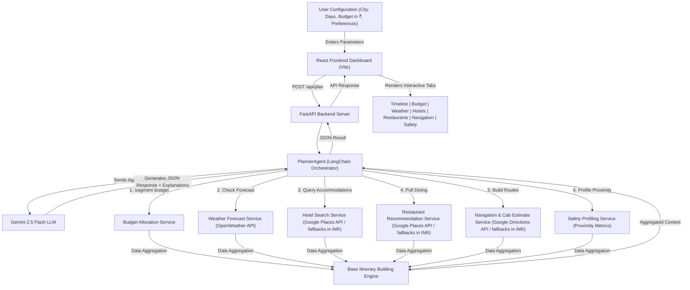

# AI Smart Travel Companion 🗺️✈️

Welcome to the **AI Smart Travel Companion**, a state-of-the-art, weather-aware, safety-scored, and budget-optimized destination planning assistant. This application leverages the power of GenAI (Gemini 2.5 Flash) and specialized planning tools to generate tailored, day-by-day travel itineraries in Indian Rupees (₹ / INR).

---

## 🌟 Key Features

* 💰 **Intelligent Budget Allocation**: Inputs travel budgets in Indian Rupees (₹ / INR) and automatically categorizes allocations into Transport (30%), Hotels (35%), Food (15%), Activities (10%), and Emergency Backups (10%).
* 🌦️ **Weather-Aware Itinerary Adjustments**: Fetches live weather forecasts (via OpenWeather API) and dynamically shifts outdoor sightseeing routes to indoor attractions (e.g., museums, galleries) if rain or extreme temperatures are predicted.
* 🏨 **Smart Hotel Recommendations**: Ranks nearby accommodations based on rating scores, reviews, proximity to public transit, and safety factors, matching your budget.
* 🍽️ **Gastronomy & Restaurant Finder**: Recommends top-rated food places matching your budget per meal, taking food preferences (e.g., vegetarian) into account.
* 🚇 **Smart Transit Assistant**: Provides metro routes, walking details, and local cab fare estimates in Rupees (`₹`) to help you navigate between destinations.
* 🛡️ **Safety Scoring System**: Evaluates neighborhood safety profiles based on emergency services proximity (distance to nearest hospitals, police stations) and crowdsourced ratings.
* 🤖 **Gemini-Powered Orchestration**: Employs LangChain and Gemini 2.5 Flash as a reasoning agent to tie all tool outputs together into a cohesive travel guide.

---

## 🏗️ System Architecture

The following diagram illustrates how the frontend React dashboard communicates with the FastAPI backend orchestrator and tools:



---

## 🛠️ Technology Stack

| Layer | Technology / Packages | Description |
| :--- | :--- | :--- |
| **Backend Core** | Python, FastAPI, Uvicorn | High-performance API server with hot-reloading. |
| **Orchestration** | LangChain, LangChain-Google-GenAI | AI agent framework integrating LLM reasoning with tool invocations. |
| **AI Model** | Gemini 2.5 Flash | Large Language Model producing JSON structures & explainable plans. |
| **Validation** | Pydantic (>=2.13.4), Pydantic-Settings | Data serialization, schemas, and setting loading. |
| **External APIs** | OpenWeather API, Google Places, Google Directions | Live weather forecasts, hotel queries, dining searches, and route mapping. |
| **Frontend UI** | React.js (v19), Vite (v8) | Premium, blazing-fast single page client application. |
| **Styling** | Vanilla CSS | Custom modern glassmorphic theme, micro-animations, and fluid responsive grids. |

---

## 📂 Directory Structure

```text
ai_smart_travel_companion/
│
├── backend/                       # Python Backend Service
│   ├── agents/
│   │   └── planner_agent.py       # LangChain orchestrator prompting Gemini LLM
│   ├── services/
│   │   ├── budget_service.py      # Divides funds into specific percentage categories
│   │   ├── hotel_service.py       # Queries, scores, and ranks accommodations in INR
│   │   ├── itinerary_service.py   # Assembles base itineraries adjusting for weather
│   │   ├── navigation_service.py  # Calculates travel metrics and INR taxi pricing
│   │   ├── restaurant_service.py  # Renders local dining recommendation lists
│   │   ├── safety_service.py      # Compiles safety tier score cards
│   │   └── weather_service.py     # Pulls forecast summaries
│   ├── tools/
│   │   └── tools.py               # LangChain-decorated wrappers around services
│   ├── .env                       # API Configuration keys (gitignored)
│   ├── main.py                    # FastAPI application and routing endpoints
│   ├── requirements.txt           # Python packages and environment definitions
│   └── test_backend.py            # Integration test script for API pipelines
│
├── frontend/                      # React Frontend Client
│   ├── src/
│   │   ├── App.jsx                # Interactive dashboard layouts and states
│   │   ├── App.css                # Global stylesheets (glassmorphic visual design)
│   │   └── main.jsx               # Entry React bootstrap
│   ├── index.html                 # HTML structure wrapper
│   ├── package.json               # Node script and package requirements
│   └── vite.config.js             # Vite building parameters
│
└── README.md                      # Project documentation
```

---

## 🚀 Installation & Running

### Step 1: Environment Variables Setup

Create a `.env` file inside the `backend/` directory:

```env
GEMINI_API_KEY=your_gemini_api_key_here
OPENWEATHER_API_KEY=your_openweather_api_key_here
GOOGLE_MAPS_API_KEY=your_google_maps_api_key_here
PORT=8000
```

> [!NOTE]
> The hotel, restaurant, weather, and navigation services will automatically fallback to high-fidelity mock data if Google Maps/OpenWeather keys are missing or invalid, allowing you to test the app seamlessly.

### Step 2: Setup and Start the Backend

1. Navigate to the backend directory:
   ```powershell
   cd backend
   ```
2. Install Python dependencies:
   ```powershell
   pip install -r requirements.txt
   ```
3. Run the API server:
   ```powershell
   uvicorn main:app --reload --port 8000
   ```
   The backend server will run on `http://127.0.0.1:8000`. You can inspect the interactive docs at `/docs`.

### Step 3: Run Backend Tests

To run the automated integration tests and check if services are compiling successfully:
```powershell
python test_backend.py
```

### Step 4: Setup and Start the Frontend

1. Open a new terminal and navigate to the frontend directory:
   ```powershell
   cd frontend
   ```
2. Install Node dependencies:
   ```powershell
   npm install
   ```
3. Launch Vite's local dev server:
   ```powershell
   npm run dev
   ```
   Open your browser and navigate to `http://localhost:5173`.

---

## 🛡️ License

This project is open-source and available under the MIT License.
