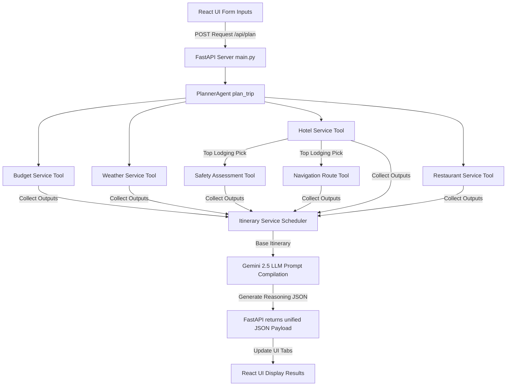

# AI Smart Travel Companion - Project Description

Welcome to the **AI Smart Travel Companion** project! This document outlines the system architecture, technologies utilized, detailed workflow, file-by-file catalog, and API integration details.

---

## 1. Project Overview & Objective

The **AI Smart Travel Companion** is a weather-aware, safety-scored, and budget-optimized trip planner. It coordinates modern AI models and traditional Web APIs to generate personalized travel itineraries. The application allows users to input their destination, trip duration, budget, group size, local transport preferences, and customized traveler interests. In response, it queries weather forecasts, lodging, dining, navigation, and safety indexes, before compiling them into a day-by-day travel timeline utilizing the Google Gemini LLM.

---

## 2. Technology Stack & How They Work

This project divides responsibilities between a Python backend and a React frontend:

### Backend (Python)
- **FastAPI**: A high-performance, asynchronous Web framework for building REST APIs with Python. It serves as the gateway connecting React inputs to our orchestration tools.
- **Pydantic**: Provides static type declarations and automated data validation constraints for HTTP requests using Python class attributes.
- **LangChain & LangChain Google GenAI**: Used as an orchestration layer to construct custom `@tool` wrappers and interfaces with the Gemini model.
- **Google Gemini API (`gemini-2.5-flash`)**: The core LLM used to read all aggregated service outputs (budget metrics, weather, hotels, safety scores, navigation steps) and compile a cohesive executive summary, hotel choice justification, restaurant selection reasoning, and weather adaptation details.
- **Google Places API (Text Search)**: Fetches real-world accommodations and dining spots in the target destination.
- **Google Directions API**: Calculates distance, duration, transit routes, and walking steps between chosen locations.
- **OpenWeatherMap API (5-Day/3-Hour Forecast)**: Gathers temperature alerts, rain chances, and weather profiles to feed the itinerary scheduler.
- **Uvicorn**: An ASGI web server implementation that runs the FastAPI application on a local loopback port (`127.0.0.1:8000`).
- **Python-Dotenv**: Automatically loads secrets and key values from a local `.env` configuration file.

### Frontend (JavaScript/React)
- **React**: A component-based single-page application (SPA) UI framework.
- **Vite**: A fast bundler and local development server.
- **Vanilla CSS**: Curated custom styling (supporting dark-theme modes, responsive grids, transitions, and sliders).

---

## 3. Detailed System Workflow

The following diagram illustrates how the system coordinates inputs and coordinates data sources:



### Step-by-Step Execution:
1. **Input Submission**: The traveler enters details (e.g. Destination: Paris, Budget: ₹1,20,000, 3 Days) on the React dashboard.
2. **API Request Dispatch**: The React app sends a POST request containing input parameters as JSON to the FastAPI endpoint `/api/plan`.
3. **Agent Orchestration**: The `PlannerAgent` splits the inputs and coordinates backend services:
   - Queries the **Budget Service** to categorize total funds into Hotel (35%), Transport (30%), Food (15%), Activities (10%), and Emergency (10%) categories.
   - Queries the **Weather Service** to pull a 5-day forecast.
   - Calls the **Hotel Service** to fetch lodging within the calculated nightly limit.
   - Selects the top-ranked hotel, and queries the **Safety Service** and **Navigation Service** (routing path from the hotel to the central station).
   - Queries the **Restaurant Service** to find dining within the single-meal budget limit.
   - Passes all inputs to the **Itinerary Service**, which shifts schedules dynamically (assigns indoor activities on rainy forecast days and outdoor activities on clear forecast days).
4. **AI Generation**: The agent formats a prompt compiling all structured tool outputs and instructs the **Gemini model** to output a consolidated JSON package, providing text justifications (`ai_reasoning`).
5. **State Rendering**: The server returns the final JSON. React updates the dashboard layout, enabling the user to switch between tabs (Timeline, Budget share, Weather alerts, Hotels list, Restaurants list, Navigation routes, Safety ratings).

---

## 4. Are We Using FastAPI? (Where and How)

**Yes, we are using FastAPI!** 

FastAPI serves as the core web application server for the backend. It is implemented in:
- **[backend/main.py](file:///d:/ai_smart_travel_companion/backend/main.py)**

### How FastAPI is Used in `main.py`:
1. **Application Initialization**:
   ```python
   app = FastAPI(title="AI Smart Travel Companion API")
   ```
2. **CORS Middleware Bindings**: Configures CORS filters to allow the React client (origin: `http://localhost:5173`) to communicate with the Python server (port: `8000`).
   ```python
   app.add_middleware(
       CORSMiddleware,
       allow_origins=["*"],
       allow_credentials=True,
       allow_methods=["*"],
       allow_headers=["*"],
   )
   ```
3. **Endpoint Routing Decorators**:
   - `@app.get("/api/health")`: Health check route.
   - `@app.post("/api/plan")`: Validates incoming `PlanRequest` bodies, handles request cache lookups, triggers `PlannerAgent.plan_trip`, and returns the plan.
   - `@app.post("/api/regenerate")`: Validates `RegenerateRequest` payloads, and recalculates specific parts of the itinerary on-the-fly (e.g., swapping budget levels, simulating rain conditions, rotating hotels).
4. **Pydantic Validation**: Declares request validation templates (`PlanRequest` and `RegenerateRequest` classes inheriting from `BaseModel`) which validate fields at compile-time and handle client input validation errors.

---

## 5. Complete File-by-File Catalog

Every file in the workspace has a distinct, dedicated role:

### Backend Files (`/backend`)
- **[main.py](file:///d:/ai_smart_travel_companion/backend/main.py)**: The entrypoint file for the API. Sets up routes, validation schemas, CORS middleware, API request caching, and the uvicorn runtime runner.
- **[requirements.txt](file:///d:/ai_smart_travel_companion/backend/requirements.txt)**: Specifies Python packages and library versions (FastAPI, LangChain, requests, Pydantic, etc.).
- **[.env](file:///d:/ai_smart_travel_companion/backend/.env)**: Environment configuration storing sensitive API authentication keys (e.g., `GEMINI_API_KEY`, `GOOGLE_PLACES_API_KEY`, etc.).
- **[test_backend.py](file:///d:/ai_smart_travel_companion/backend/test_backend.py)**: An integration test script that programmatically runs each service and agent to verify correctness.

#### Agents Directory (`/backend/agents`)
- **[planner_agent.py](file:///d:/ai_smart_travel_companion/backend/agents/planner_agent.py)**: The main AI agent that coordinates all tools sequentially to collect data, compiles the LLM prompt, and invokes Gemini to get structured reasoning JSON.

#### Tools Directory (`/backend/tools`)
- **[tools.py](file:///d:/ai_smart_travel_companion/backend/tools/tools.py)**: Declares LangChain `@tool` wrappers around individual service helper classes, exposing service interfaces to the Planner Agent.

#### Services Directory (`/backend/services`)
- **[budget_service.py](file:///d:/ai_smart_travel_companion/backend/services/budget_service.py)**: Calculates budget splits into Hotel, Transport, Food, Activities, and Emergency, and computes individual shares.
- **[weather_service.py](file:///d:/ai_smart_travel_companion/backend/services/weather_service.py)**: Interacts with the OpenWeatherMap API, aggregates 3-hour forecasts into daily summaries, and checks for rain or high temp warnings.
- **[hotel_service.py](file:///d:/ai_smart_travel_companion/backend/services/hotel_service.py)**: Searches for hotels via Google Places API and ranks them using rating, distance from city center, and transit proximity.
- **[restaurant_service.py](file:///d:/ai_smart_travel_companion/backend/services/restaurant_service.py)**: Queries and ranks local dining venues based on ratings, vegetarian options, location, and budget constraints.
- **[navigation_service.py](file:///d:/ai_smart_travel_companion/backend/services/navigation_service.py)**: Requests route details from the Google Directions API and parses HTML instructions, walking legs, and cab costs.
- **[safety_service.py](file:///d:/ai_smart_travel_companion/backend/services/safety_service.py)**: Evaluates a hotel's safety tier by calculating proximity metrics to emergency services (police, hospitals, transit).
- **[itinerary_service.py](file:///d:/ai_smart_travel_companion/backend/services/itinerary_service.py)**: Compiles the day-by-day travel schedule, switching between indoor and outdoor activities depending on rain alerts.

### Frontend Files (`/frontend`)
- **[package.json](file:///d:/ai_smart_travel_companion/frontend/package.json)**: Declares React web dependencies, Vite build configurations, and npm commands.
- **[vite.config.js](file:///d:/ai_smart_travel_companion/frontend/vite.config.js)**: Configures Vite compiler parameters and plugins.
- **[index.html](file:///d:/ai_smart_travel_companion/frontend/index.html)**: The single page HTML container element that hosts React application mounts.
- **[src/main.jsx](file:///d:/ai_smart_travel_companion/frontend/src/main.jsx)**: Entry point file that bootstraps React and imports CSS assets.
- **[src/App.jsx](file:///d:/ai_smart_travel_companion/frontend/src/App.jsx)**: The central React dashboard layout component. Declares inputs state variables, preference list handlers, API fetch operations, and renders tabs and charts.
- **[src/App.css](file:///d:/ai_smart_travel_companion/frontend/src/App.css)**: Core CSS stylings for individual card structures, forms, loading spinners, and layout themes.
- **[src/index.css](file:///d:/ai_smart_travel_companion/frontend/src/index.css)**: CSS style system definitions, custom scrollbars, layout typography, and CSS custom variables.
